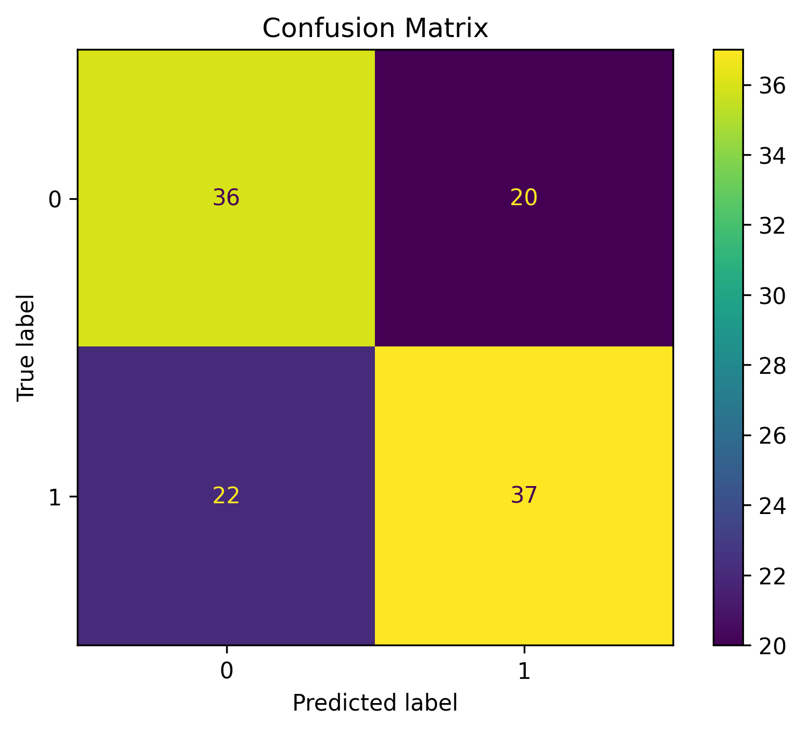
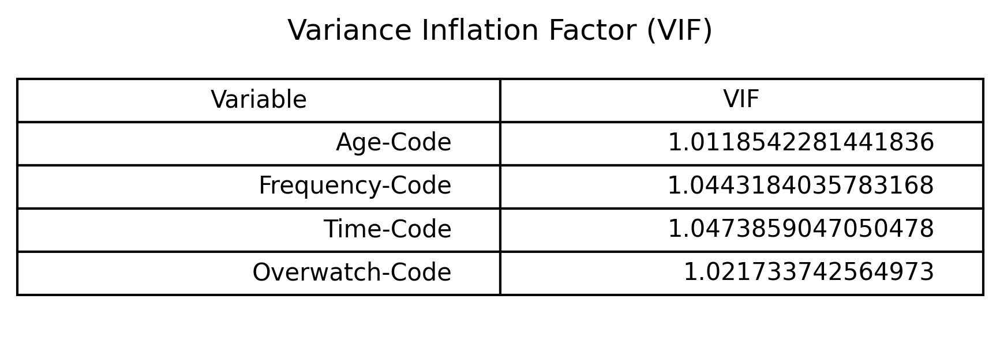

# Streaming Behavior & Student Study Delay Analysis (Logistic Regression)

An econometrics study analyzing the impact of streaming behavior (time, frequency, binge-watching, and age) on students' study delay during examination periods using primary survey data ($N = 118$).

---

## Objective
To empirically evaluate whether digital streaming habits significantly influence a student's likelihood of delaying their studies during crucial exam preparation windows.

## Dataset & Variables
* **Sample Size:** 118 primary survey responses
* **Dependent Variable (Y):** Study Delay (`Yes` / `No` - Binary)
* **Independent Variables (X):**
  * Age
  * Daily Streaming Time
  * Weekly Streaming Frequency
  * Binge-Watching Behavioral Traits

## Methodology & Statistical Validation
1. **Descriptive Analysis:** Initial data profiling and demographic summaries.
2. **Binary Logistic Regression:** Modeling the log-odds of a study delay based on behavioral predictors.
3. **Multicollinearity Diagnostic:** Variance Inflation Factor (VIF) checking to ensure stable coefficients.
4. **Model Performance Evaluation:** Confusion Matrix calculations for accuracy, sensitivity, and specificity boundaries.

---

## Model Outputs & Visualizations

### Logistic Regression Curve

### Model Performance Metrics
Below are the statistical diagnostics, classification checks, and multicollinearity evaluations derived from the analysis:

| Confusion Matrix | Coefficients Analysis |
| :---: | :---: |
|  |  |

### Multicollinearity Diagnostics (VIF Table)

---

## 📂 Project Repository Structure
* `Econometrics-Analysis.xlsx` — Raw data management, cleaning, and preliminary cross-tabulations.
* `Streaming_data.csv` — Final processed dataset utilized for modeling.
* `Report Econometrics.pdf` — Complete formal research paper outlining theoretical frameworks and conclusions.
